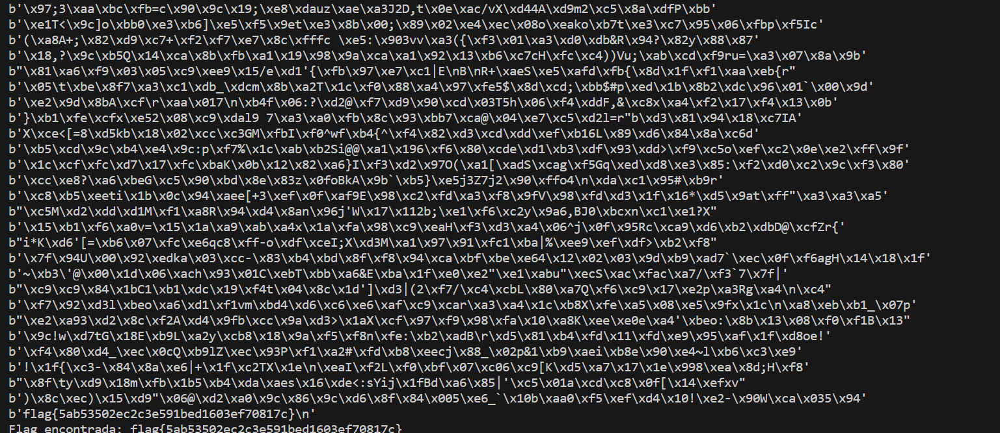

# CTF Semana #10 (Weak Encryption)

## Introdução

Ao analisar o ficheiro `cipherspec.py`, observamos três funções: 

- `dec(k, c, nonce)` - desencripta um texto `c`, uma chave `k` e um `nonce` (número gerado aleatoriamente e usado apenas uma vez, que previne a reutilização m de chaves criptográficas e protege de ataques de repetição).

- `enc(k, m, nonce)` - encripta um texto `m`, usando a chave `k` e o `nonce`.

- `gen()` - função que gera as chaves usadas na encriptação e desencriptação de textos. A chave é composta por um prefixo de 13 bytes nulos (`b'\x00' * (KEYLEN-offset)`), seguido por 3 bytes aleatórios gerados por `os.urandom(offset)`.

## Resolução do CTF

### Como consigo usar esta ciphersuite para cifrar e decifrar dados?

- Para encriptar dados, geramos uma chave usando a função `gen()` e, em seguida, usamos a função `enc()` com essa mesma chave, o texto não cifrado e um nonce. Para decifrar dados, usamos a função `dec()` com a chave gerada, o texto cifrado e o mesmo nonce utilizado na encriptação.

### Como consigo fazer uso da vulnerabilidade que observei para quebrar o código?

- A vulnerabilidade está na função gen(), que gera uma chave AES com os primeiros 13 bytes definidos como zero. Isso reduz significativamente o espaço aleatório da chave, tornando um ataque **brute force** viável. 

### Como consigo automatizar este processo, para que o meu ataque saiba que encontrou a flag?

- Ao criar um script, podemos testar todas as combinações possíveis para os últimos 3 bytes da chave até encontrar a chave correta que decifra a flag.

```python
from cryptography.hazmat.backends import default_backend
from cryptography.hazmat.primitives.ciphers import Cipher, algorithms, modes
from binascii import unhexlify
import os

def dec(k, c, nonce):
    cipher = Cipher(algorithms.AES(k), modes.CTR(nonce), backend=default_backend())
    decryptor = cipher.decryptor()
    msg = b""
    msg += decryptor.update(c)
    msg += decryptor.finalize()
    return msg

nonce1 = unhexlify("6a2a9cc293f21663e57123457715917d")
ciphertext1 = unhexlify("1ef60eb4781e336041e9573a85028b5f06a4ff1b272d5080dc276a40abe7449d8cca10d86b795d")

for i in range(256**3):  # Testar todas as combinações de 3 bytes
    key = bytearray(b'\x00' * 13) + i.to_bytes(3, 'big')
    decrypted_text = dec(bytes(key), ciphertext1, nonce1)
    print(decrypted_text)
    if b'flag{' in decrypted_text:
        print("Flag encontrada:", decrypted_text.decode())
        break

print("Flag não encontrada.")
```

Usando este código e após algum tempo de espera, conseguimos encontrar a flag:

