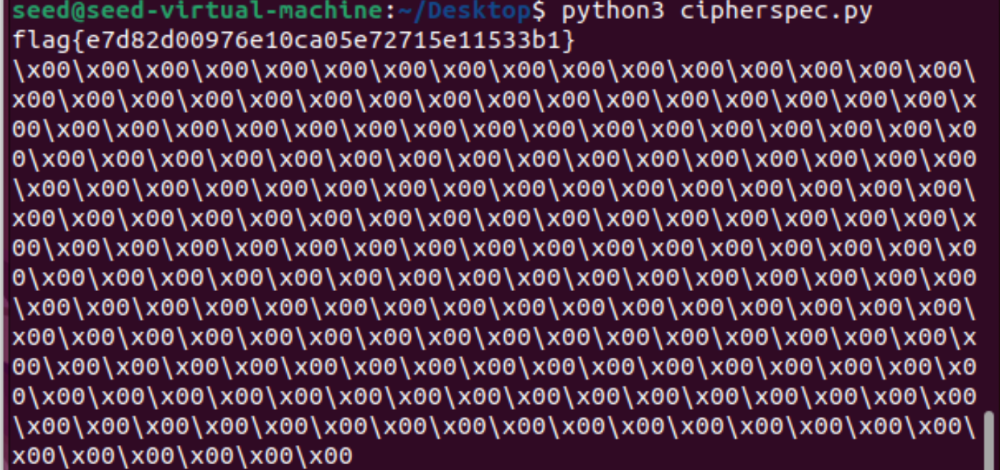

# CTF Semana 11 (RSA)

Começamos por descarregar o ficheiro fornecido na plantaforma e analisa-lo.

Como vamos ter de verificar se os numeros são primos, seguimos a sugestão do enunciado e fomos buscar o algoritmo de "Miller-Rabin":

```py
def is_prime(n):
    if n != int(n):
        return False
    n = int(n)

    if n == 0 or n == 1 or n == 4 or n == 6 or n == 8 or n == 9:
        return False

    if n == 2 or n == 3 or n == 5 or n == 7:
        return True
    s = 0
    d = n - 1
    while d % 2 == 0:
        d >>= 1
        s += 1

    def trial_composite(a):
        if pow(a, d, n) == 1:
            return False
        for i in range(s):
            if pow(a, 2 ** i * d, n) == n - 1:
                return False
        return True

    for i in range(8):
        a = random.randrange(2, n)
        if trial_composite(a):
            return False

    return True
```

Depois criamos uma função para procuar o p e o q perto dos valores indicados ( p é perto de 2^512 e q é perto de 2^513):

```py
def find_p_q():
    n = 359538626972463181545861038157804946723595395788461314546860162315465351611001926265416954644815072042240227759742786715317579537628833244985694861278975882247679398542353192618125741451360923211862406826921499797811811920350907343267014884010176462291170177028894944230704078629434854490330312409849988021223
    
    for i in range(2**512 - 5000, 2**512 + 5000):
        if n % i == 0:
            p = i
            q = n // i
            if (is_prime(p) & is_prime(q)):
            	break

    return p, q
```

Como sabemos que p*q = n, ao decobrir o p sabemos o q, ainda assim verificamos se os dois são primos.

No entanto, por erro nosso descobrimos que nem era necessário usar o algoritmo de verificação dos primos. Pois a nossa função não tinha a linha
```py
if (is_prime(p) & is_prime(q))
``` 
de verificação, tinha somente o 
```py 
break
```
e o resultado foi o mesmo. O que indica que o primeiro n que verifique 
```py
n%i==0
```
como não sabemos se é prepositado por parte do exercicio para que seja menos custoso encontrar, fizemos na mesma a verificação para estar mais correto de se eram primos para estar mais correto.


Posto isto temos tudo pronto para ir ao servidor à porta 6004 e usarmos os dados que nos deram.

```py
e = 65537
n = 359538626972463181545861038157804946723595395788461314546860162315465351611001926265416954644815072042240227759742786715317579537628833244985694861278975882247679398542353192618125741451360923211862406826921499797811811920350907343267014884010176462291170177028894944230704078629434854490330312409849988021223
ciphertext= 
3731336266313736323536396132333639373430333839306431363563653438353637343536323432633035333333376435363862643838346635646665643231333763636636633136353763383533643965393530643664613662306463616534393231323965313536666165623131336232313135326464323866363335326239666137363030303730353530306330653038666234643463336231646465303432653565613264373563396130356563653938363838663361316431373966633362393136613866646233343233336530373461386539383838633061366566666538303361633534313435663266653332333937376532626464306230303030303030303030303030303030303030303030303030303030303030303030303030303030303030303030303030303030303030303030303030303030303030303030303030303030303030303030303030303030303030303030303030303030303030303030303030303030303030303030303030303030303030303030303030303030303030303030303030303030303030303030303030303030303030303030303030303030303030303030303030303030303030303030303030303030303030303030303030303030303030303030303030303030303030303030303030303030303030303030303030303030303030303030303030303030
```

Tendo isto e tendo o p e o q, fomos à procura do d que é o único que falta. E então sobre este era sabido que:
```py
(d * e) % ((p - 1) * (q - 1)) == 1
```

Que também é equivalente a:

```py
d = pow(e, -1, (p - 1) * (q - 1))
```

Tendo agora tudo, só basta trocarmos no código fornecido, correr o ficheiro e chegamos à flag:




Deixo aqui o código inteiro usado:

```py
import random
from pwn import *
from binascii import unhexlify, hexlify
import os

def is_prime(n):
    # Função para verificar se um número é primo
    if n != int(n):
        return False
    n = int(n)

    if n == 0 or n == 1 or n == 4 or n == 6 or n == 8 or n == 9:
        return False

    if n == 2 or n == 3 or n == 5 or n == 7:
        return True
    s = 0
    d = n - 1
    while d % 2 == 0:
        d >>= 1
        s += 1

    def trial_composite(a):
        if pow(a, d, n) == 1:
            return False
        for i in range(s):
            if pow(a, 2 ** i * d, n) == n - 1:
                return False
        return True

    for i in range(8):
        a = random.randrange(2, n)
        if trial_composite(a):
            return False

    return True


def find_p_q():
    # Encontrar valores válidos para p e q
    n = 359538626972463181545861038157804946723595395788461314546860162315465351611001926265416954644815072042240227759742786715317579537628833244985694861278975882247679398542353192618125741451360923211862406826921499797811811920350907343267014884010176462291170177028894944230704078629434854490330312409849988021223
    
    for i in range(2**512 - 5000, 2**512 + 5000):
        if n % i == 0:
            p = i
            q = n // i
            if (is_prime(p) & is_prime(q)):
            	break

    return p, q

def enc(x, e, n):
    int_x = int.from_bytes(x, "little")
    y = pow(int_x,e,n)
    return hexlify(y.to_bytes(256, 'little'))

def dec(y, d, n):
    int_y = int.from_bytes(unhexlify(y), "little")
    x = pow(int_y,d,n)
    return x.to_bytes(256, 'little')

def main():
    encoded_flag = unhexlify("3731336266313736323536396132333639373430333839306431363563653438353637343536323432633035333333376435363862643838346635646665643231333763636636633136353763383533643965393530643664613662306463616534393231323965313536666165623131336232313135326464323866363335326239666137363030303730353530306330653038666234643463336231646465303432653565613264373563396130356563653938363838663361316431373966633362393136613866646233343233336530373461386539383838633061366566666538303361633534313435663266653332333937376532626464306230303030303030303030303030303030303030303030303030303030303030303030303030303030303030303030303030303030303030303030303030303030303030303030303030303030303030303030303030303030303030303030303030303030303030303030303030303030303030303030303030303030303030303030303030303030303030303030303030303030303030303030303030303030303030303030303030303030303030303030303030303030303030303030303030303030303030303030303030303030303030303030303030303030303030303030303030303030303030303030303030303030303030303030303030303030")

    p, q = find_p_q()
    n = 359538626972463181545861038157804946723595395788461314546860162315465351611001926265416954644815072042240227759742786715317579537628833244985694861278975882247679398542353192618125741451360923211862406826921499797811811920350907343267014884010176462291170177028894944230704078629434854490330312409849988021223
    e = 65537
    d = pow(e, -1, (p - 1) * (q - 1))

    original_flag = dec(encoded_flag, d, n)
    print(original_flag.decode())

if __name__ == '__main__':
    main()
```
