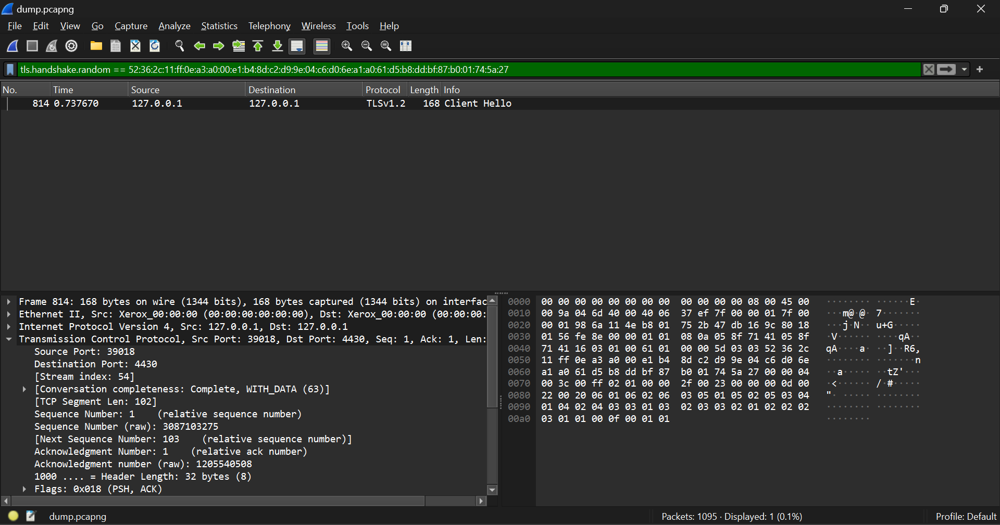
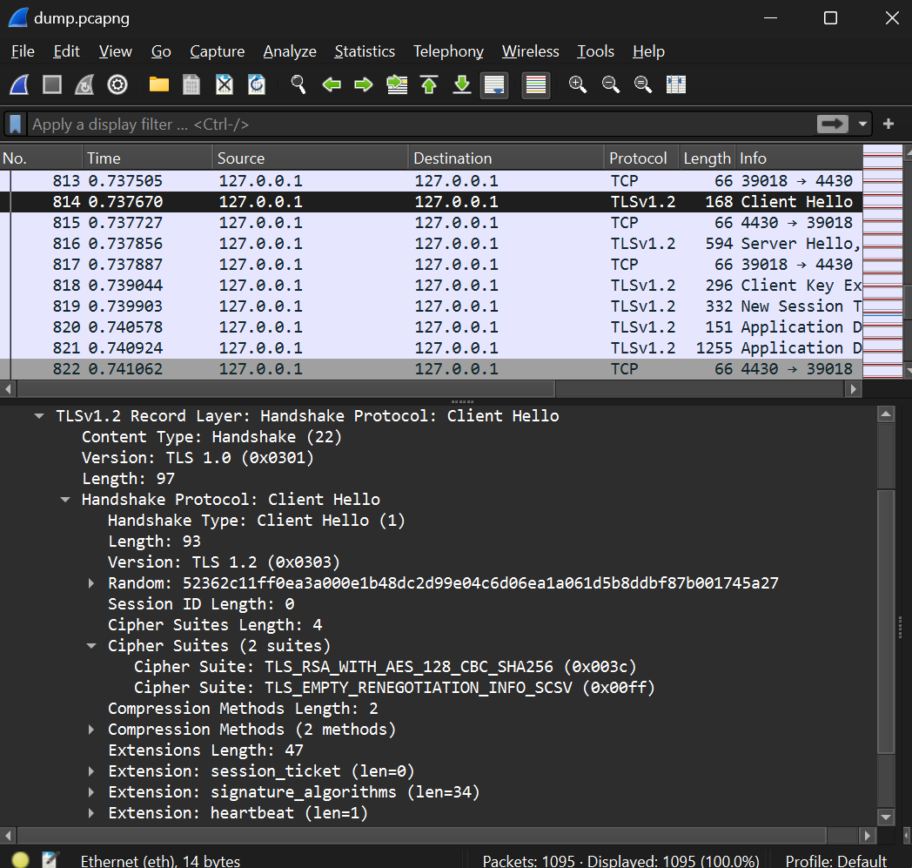

# CTF Semana #13 (Find-my-TLS)

## Introdução

É fornecido o ficheiro dump.pcapng. Este ficheiro contém uma grande quantidade de conexões TLS. A flag pode ser reconstruída a partir de vários detalhes de uma conexão específica.

A flag tem a estrutura: flag{<frame_start>-<frame_end>-<selected_cipher_suite>-<total_encrypted_appdata_exchanged>-<size_of_encrypted_message>}, onde:
- <frame_start> e <frame_end> são o primeiro e último (respetivamente) números de frame correspondentes ao procedimento de handshake do TLS.
- <selected_cipher_suite> é a ciphersuite escolhida para a conexão TLS (o nome, não o código)
- <total_encrypted_appdata_exchanged> é a soma total do tamanho dos dados cifrados trocados neste canal, até à sua terminação.
- <size_of_encrypted_message> é o tamanho da mensagem cifrada no handshake que concluí o procedimento de handshake.

## Frame Start/Frame End

Para determinar o Frame Start, é necessário localizar o pacote Client Hello:

```
tls.handshake.random == 52:36:2c:11:ff:0e:a3:a0:00:e1:b4:8d:c2:d9:9e:04:c6:d0:6e:a1:a0:61:d5:b8:dd:bf:87:b0:01:74:5a:27
```



Após observar o único log filtrado, ficamos a saber que o pacote de Frame Start é o número 814.

Ao removermos este filtro e observando os seguintes, vamos que o último pacote deste :

O último pacote desse handshake específico é o número 819.


## Selected Cipher Suite
Ao clicar no pacote Server Hello, no parâmetro Handshake Protocol: Server Hello, vemos o campo ciphersuite:

Assim, selected_cipher_suite da nossa flag é: ```TLS_RSA_WITH_AES_128_CBC_SHA256```



## Total Encrypted AppData Exchanged
Para calcular a Total Encrypted AppData Exchanged, é necessário observar o tamanho da mensagem criptografada em cada pacote de Application Data desde o início do handshake e somar esses valores.
Nesse sentido, localizamos o início do handshake, que ocorre no pacote número 814, e somamos os comprimentos dos pacotes subsequentes de Application Data.

Consequentemente, total_encrypted_appdata_exchanged é 1264 bytes (tamanho total do pacotes do ApplicationData).


## Size of Encrypted Message
É necessário novamente identificar os pacotes de handshake, pois o tamanho da mensagem criptografada está no último pacote que o conclui.

Após localizar esse pacote, o último antes do primeiro pacote de Application Data, podemos visualizar o campo length da Encrypted Handshake Message.

Portanto, size_of_encrypted_message é 80.


## Construção da flag
Após descobrir todos os valores, a flag é construída da seguinte forma:

- frame_start = 814
- frame_end = 819
- selected_cipher_suite = TLS_RSA_WITH_AES_128_CBC_SHA256
- total_encrypted_appdata_exchanged = 1406
- size_of_encrypted_message = 80
- flag = flag{814-819-TLS_RSA_WITH_AES_128_CBC_SHA256-1264-80}.


