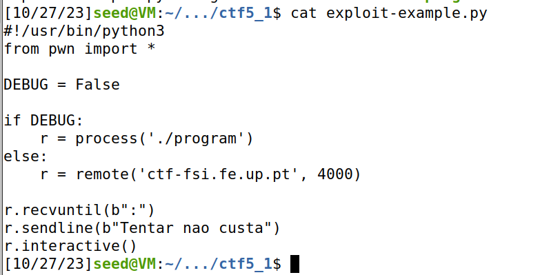
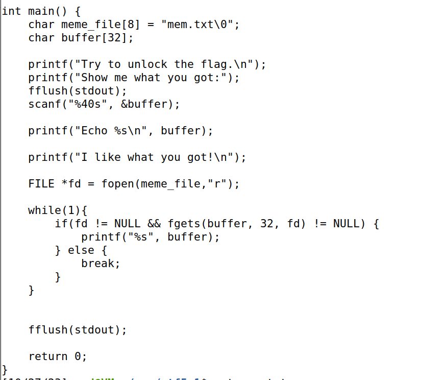
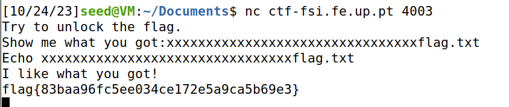
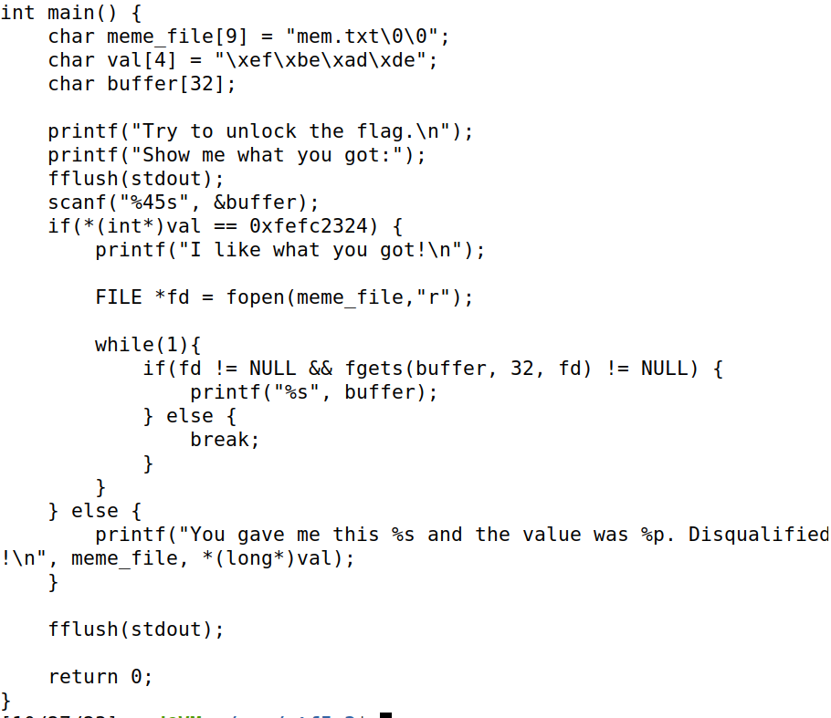
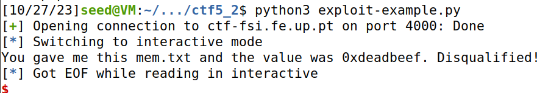
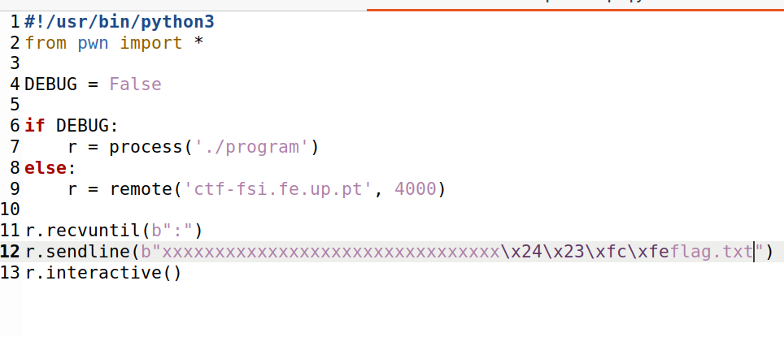
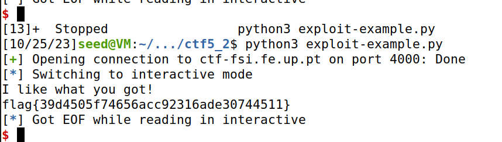

# Primeira parte CTF5

Começamos por explorar os ficheiro que nos disponibilizaram na plataforma de apoio aos CTF’s:

 
Correndo o comando `checksec program`, ficamos a saber que a arquitetura do ficheiro main.c é x86, que não existe um return address e que as posições do binário não estão randomizadas.
Observando atentamente o ficheiro main.c, verificamos que existe um array de 8 bytes de memória (`meme_file`) e 32 bytes para um buffer mostrar a flag no terminal.
Podemos observar uma função scanf que copia 40 bytes provenientes do buffer, logo pode ocorrer um buffer overflow já que o input é superior a 32 bytes.
Como já sabemos, a zona de memória alocada é contínua e depende da ordem de declaração das variáveis do main.c. Se passarmos a capacidade do buffer alocada conseguimos reescrever a zona de memória dedicada ao meme_file. 
Desta forma, para provocar este buffer overflow injetamos 32 carateres seguidos de `flag.txt`. 

 
# Segunda parte CTF5

Voltamos a analisar os ficheiro que nos disponibilizaram:

 

A parte inicial desta segunda parte é exatamente igual à primeira, o program continua a ter arquitetura x86, binário não randomizado e não existe endereço de return.
Neste ficheiro main.c, exite mais um buffer alocado, val[4].
Sabendo que o output inicial do program era:

 
Conseguimos descobrir que bytes deveriam estar no `val[]`:

`0xfefc2324 = \x24\x23\xfc\xfe`

Fica apenas a faltar injetar 32 bytes em carateres seguido do novo valor de `val` e de `flag.txt`:

  

