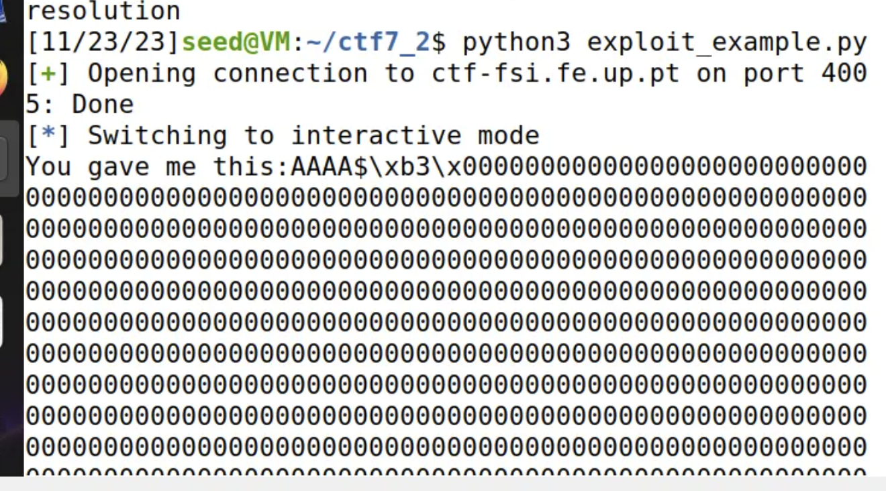
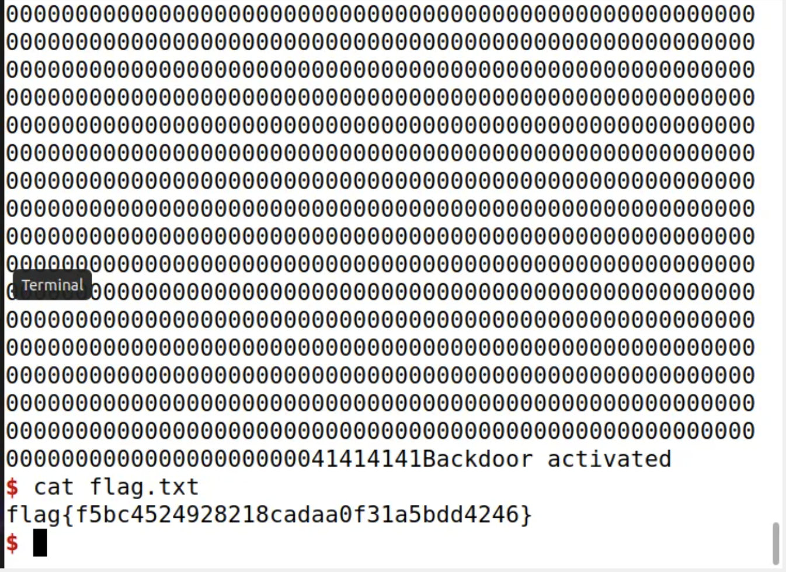

# CTF7
## Parte 1

Como dito no enunciado, começamos por analisar os ficheiros fornecidos e seguimos a instrução de começar por correr o checksec e verificamos agora as proteções ativas que este programa tem ao contrário da ultima vez. Ou seja, o program (que é o main.c compilado) usa canários como forma de proteção dos endereços de retorno. No entanto não tem o binário randomizado.


Já no código do main.c deu logo para perceber que este é vulnerável em relação a "format string attack" pois para além de não randomizar endereços ainda tem um printf sem argumentos adicionais, apenas o input que é guardado num buffer de 32 bytes através da função scanf.

No main também vemos que a flag fica em variável global (tal como a ajuda do enunciado indica), e para lermos a flag vamos ter de saber o endereço dela na memória, para isso seguimos a outra dica do enunciado e usamos o debuger gdb:

``` 
gdb ./program
p &flag 
```


Ficamos então com o endereço da flag e depois iremos usar em formato string como : "\x60\xC0\x04\x08"

Fomos então ao código fornecido no ficheiro exploit_example.py e fizemos algumas alterações:


```
p.recvuntil(b"got:")
p.sendline(b"\x60\xC0\x04\x08%s")
p.interactive()
```

E com isso conseguimos encontrar a flag local, que é dummy, para irmos buscar a flag do servidor fazemos então a ultima troca 

```
LOCAL = False
```


E com isso chegamos então à flag e finalizamos assim a primeira parte:


## Parte 2

Começamos outra vez por analisar os ficheiros fornecidos e reparamos novamente que o Program continua sem randomização de endereço. Porém, reparamos diferenças no main.c que agora é lançada uma bash se o valor key for 0xBEEF, ou seja, 48879 em decimal. A partir daqui vamos poder chegar ao conteúdo do ficheiro flag.txt.

Como a key é uma variável global está na Heap, e por isso vamos usar um format string attack do input através de '%n'. Para isso fomos buscar o valor de endereço da variável global key, seguindo novamente a dica do enunciado, com o gdb:

```
gdb ./program
p &key
```

Está no endereço: "0x0804B324" que é "\x24\xB3\x04\x08" em hexadecimal. Como queremos escrever 48879 neste endereço tivemos de modificar a string dada como input: após o endereço pretendido (4 bytes) é necessário escrever exatamente 48879 - 8 = 48871 bytes antes de '%n'. Temos de ter em conta que o buffer de entrada só tem no máximo 32 bytes disponíveis, e por isso chegamos à expressão de leitura do printf %.Nx, com N = 48871.

```
p = remote("ctf-fsi.fe.up.pt", 4005)

p.recvuntil(b"here...")
p.sendline(b"AAAA\x24\xB3\x04\x08%.48871x%n")
p.interactive()
```




E ao executar chegamos à nova flag.
