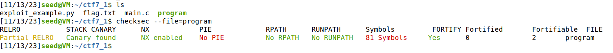
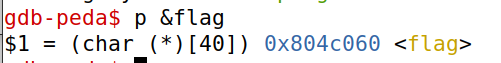
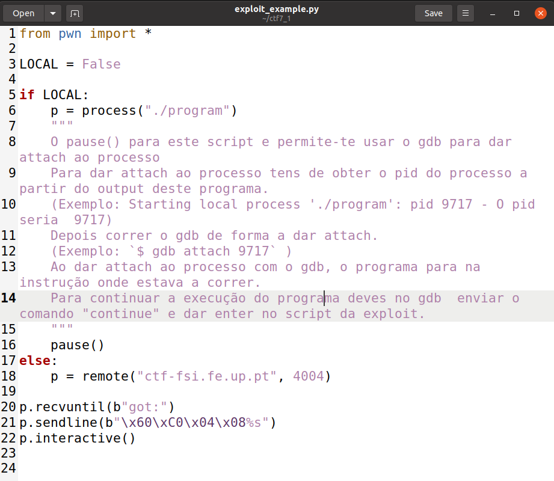
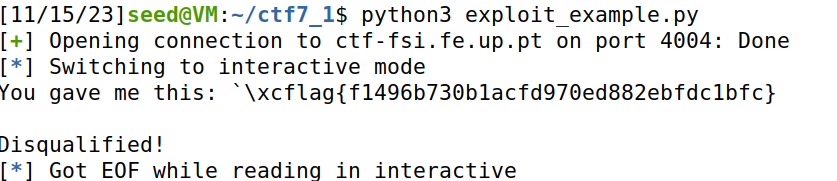

# CTF7
## Parte 1

Como dito no enunciado, começamos por analisar os ficheiros fornecidos e seguimos a instrução de começar por correr o checksec e verificamos agora as proteções ativas que este programa tem ao contrário da ultima vez. Ou seja, o program (que é o main.c compilado) usa canários como forma de proteção dos endereços de retorno. No entanto não tem o binário randomizado.




Já no código do main.c deu logo para perceber que este é vulnerável em relação a "format string attack" pois para além de não randomizar endereços ainda tem um printf sem argumentos adicionais, apenas o input que é guardado num buffer de 32 bytes através da função scanf.

No main também vemos que a flag fica em variável global (tal como a ajuda do enunciado indica), e para lermos a flag vamos ter de saber o endereço dela na memória, para isso seguimos a outra dica do enunciado e usamos o debuger gdb:

``` 
gdb ./program
p &flag 
```



Ficamos então com o endereço da flag e depois iremos usar em formato string como : "\x60\xC0\x04\x08"

Fomos então ao código fornecido no ficheiro exploit_example.py e fizemos algumas alterações:


```
p.recvuntil(b"got:")
p.sendline(b"\x60\xC0\x04\x08%s")
p.interactive()
```

E com isso conseguimos encontrar a flag local, que é dummy, para irmos buscar a flag do servidor fazemos então a ultima troca 

```
LOCAL = False
```



E com isso chegamos então à flag e finalizamos assim a primeira parte:


