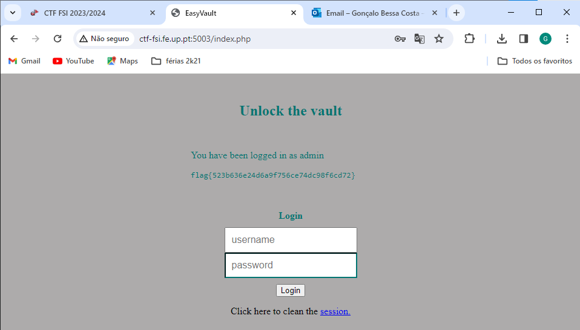

# CTF8
Como dito no enunciado, começamos por analisar o código no ficheiro "index.php". Em semelhança ao que acontece no guião, verificamos que a Query está mal feita e utiliza diretamente as variáveis $username e $password sem que estas sejam sanitizadas, ou seja, sem que estas sejam revistas com um processo de limpeza / validação / transformação dos dados para garantir que estejam num formato seguro e adequado. <br>

```php
$username = $_POST['username'];
$password = $_POST['password'];
$query = "SELECT username FROM user WHERE username = '".$username."' AND password = '".$password."'";
```

Foi possível também verificar que a base de dados é SQLite3 e para o conteúdo do ficheiro flag.txt ser mostrado no site, então o nome do username tem de ser "admin".

Logo, podemos utilizar isto a nosso favor e criar um ataque malicioso para colocar no input do username de forma a que ignore ser preciso colocar a password.

Conseguimos fazer isso com o input "admin'--" onde vamos então colocar o username necessário e comentar o que vem depois com o "--".

```sql
SELECT username FROM user WHERE username = 'admin' -- AND password = $password
```
E esta será a query que efetivamente será executada com o login. 



