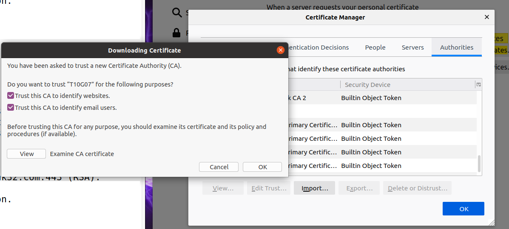
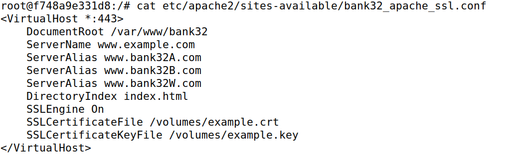

# Public-Key Infrastructure

## Setup

Como é referido o guião temos de adicionar novas entradas nos hosts conhecidos pela máquina virtual. 
```bash
sudo nano /etc/hosts     # colocamos '10.9.0.80 www.bank32.com'
```

E iniciamos o docker
```bash
dcbuild
dcup
```

## Task1: Becoming a Certificate Authority (CA)

Como dito no guião, fomos ao diretório /usr/lib/ssl/openssl.cnf, e começamos por copiar o ficheiro openssl.cnf para o diretório do labsetup

```bash
cp /usr/lib/ssl/openssl.cnf .
```

Depois analisamos o ficheiro e descomentamos a linha
```
#unique_subject = no
```

Em seguida executamos os seguintes comandos para criar os diretórios necessários:

```bash
mkdir demoCA
cd demoCA
mkdir certs
mkdir newcerts
mkdir crl
touch index.txt
echo "1000" >> serial
```

Como indicado, fizemos o Setup do CA:

```bash
- passphrase (1111)
- nome do país (PT)
- região (Porto)
- cidade (Matosinhos)
- organização (UP)
- secção (FEUP)
- nome (T10G07)
- email (exemplo@fe.up.pt)
```


Posto isto, decodificamos o certificado X509 e a chave RSA:
```bash
openssl x509 -in ca.crt -text -noout
openssl rsa -in ca.key -text -noout
```


Para responder às 3 questões:
- Verificamos que se trata realmente de um certificado CA pois CA = TRUE
- Sabemos também que o certificado é self-signed pois o campo issuer e o campo subject é igual.
- Para a ultima questão, conseguimos com os comandos a cima anteriormente usados, chegar a estes campos:

```
os dois números primos (campo prime1 e prime2);
o modulus (campo modulus);
os expoentes públicos e privados (campo publicExponent e privateExponent, respetivamente);
o coeficiente (campo coeficient);
```

## Task 2 - Generating a Certificate Request for Your Web Server 

Para gerar o certificado do nosso próprio servidor usamos o comando fornecido no enunciado:

```bash
openssl req -newkey rsa:2048 -sha256 \
-keyout server.key -out server.csr \
-subj "/CN=www.bank32.com/O=Bank32 Inc./C=US" \
-passout pass:1111 \
-addext "subjectAltName = DNS:www.bank32.com, \
DNS:www.bank32A.com, \
DNS:www.bank32B.com"
```


##Task 3 - Generating a Certificate for your server

Começamos por fazer o indicado no guião e como os arquivos CRS são enviados para uma CA confiável, nós adaptamos à nossa própria CA para gerar certificados, e executamos o comando indicado:

```bash
openssl ca -config openssl.cnf -policy policy_anything -md sha256 -days 3650 -in server.csr -out server.crt -batch -cert ca.crt -keyfile ca.key
```


Descomentamos também a linha:


No server.crt podemos confirmar que as alterações feitas na task2 deram resultado e que se trata de um certificado para o servidor supracitado:


##Task 3 - Deploying Certificate in an Apache-Based HTTPS Website

Começamos a task4 por criar um terminal para correr o container:


E copiamos os ficheiros "server.crt" e "server.key" para o diretório /volumes mas mudamos os nomes para "bank32.crt" e "bank32.key".
Em seguida tivemos de modificar o ficheiro 
```bash
nano /etc/apache2/sites-available/bank32_apache_ssl.conf
```
para podermos trocar para o diretório para onde os copiei. (volumes)


E demos start ao servidor Apache:


Ao tentar aceder ao site ```www.bank32.com``` verificamos que a ligação não era encriptada e não estava segura. 


Mas para corrigir isso fomos adicionar o certificado CA que geramos às autoridades no browser. Fomos a ```preferences#privacy->Certificates->View Certificates->Autorities->Import```



E assim sendo passa a ligação a segura:


## Task 5 - Lauching a Man-In-The-Middle Attack

Alteramos novamente o ficheiro:
```bash
nano /etc/apache2/sites-available/bank32_apache_ssl.conf
```
Para desta vez a configuração do servidor apresentar o site ```www.example.com```


Ligamos também o hostname ```www.example.com```ao IP do webserver malicioso:


E iniciando novamente o servidor fomos depois ao site www.example.com e verificamos que a ligação não é segura e que o browser aponta para um potencial risco:


Isto acontece porque o nome de dominio não coincide com aquele presente no certificado do servidor.

##Task 6 - Lauching a Man-in-The-Middle Attack with a compromised CA

Nesta tarefa começamos por assumir que o passo 1 já está feito. Mas vamos repetir os comandos da Task2:

```bash
openssl req -newkey rsa:2048 -sha256 -keyout example.key -out example.csr -subj "/CN=www.example.com/O=example Inc./C=US" -passout pass:1111

openssl ca -config openssl.cnf -policy policy_anything \
-md sha256 -days 3650 \
-in server.csr -out server.crt -batch \
-cert ca.crt -keyfile ca.key
```

Posto isto temos de fazer o equivalente à task3 e utilizar os dois ficheiros que foram criados ```example.csr e example.key```

e modificar o ficheiro:

```bash
nano /etc/apache2/sites-available/bank32_apache_ssl.conf
```


Depois se reiniciarmos o servidor e formos outra vez ao site ```www.example.com``` verificamos que a ligação já fica segura:


