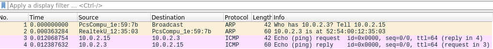
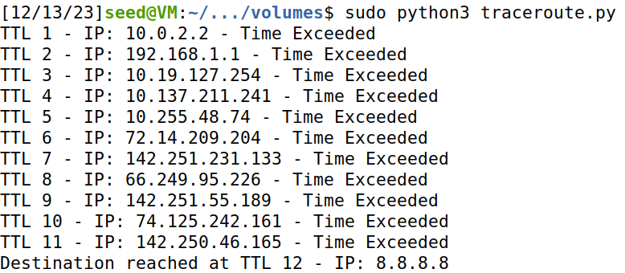
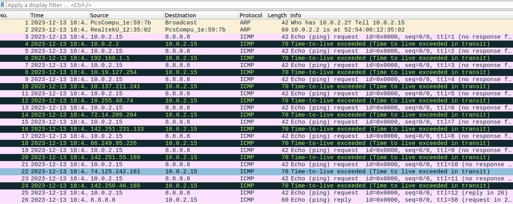
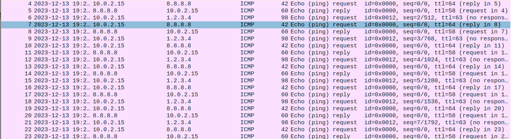
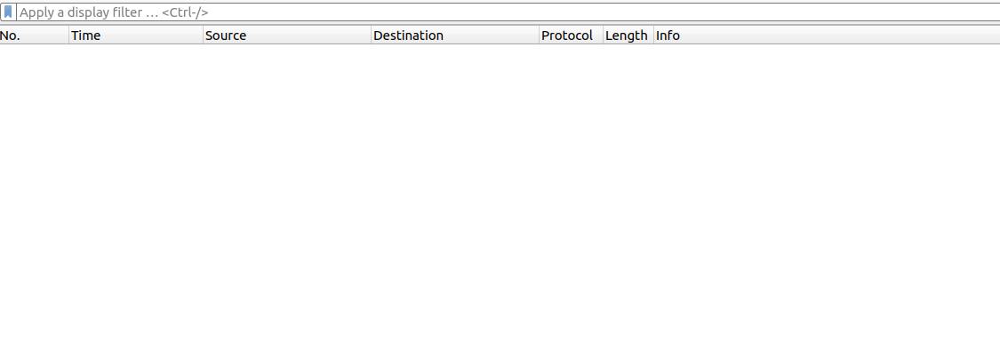
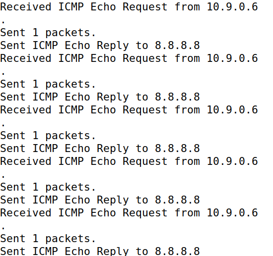
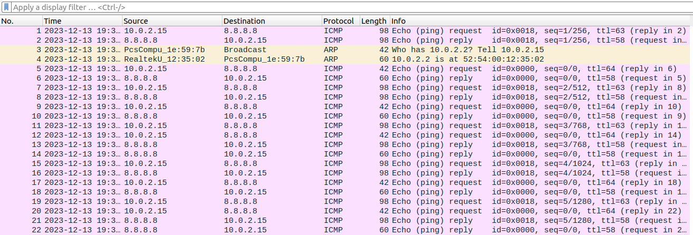

# Sniffing and Spoofing
## Setup


Começamos por descobrir o nome da network interface do container na nossa VM. Corremos ifconfig no terminal e procuramos o IP 10.9.0.1:

```
ifconfig
br-35f18959ffa2: flags=4163<UP,BROADCAST,RUNNING,MULTICAST>  mtu 1500
        inet 10.9.0.1  netmask 255.255.255.0  broadcast 10.9.0.255
```

## Task 1 - Using Scapy to Sniff and Spoof Packets

Para esta task começamos por criar um ficheiro python (mycode.py) com o seguinte código:

```py
from scapy.all import * 

a = IP()
a.show()
```

Depois corremos o ficheiro em modo root:

```
chmod a+x mycode.py
python3 mycode.py
```

```
###[ IP ]###
    version = 4
    ihl = Nonetos = 0x0
    len = None
    id = 1
    flags =
    frag = 0
    ttl = 64
    proto = hopopt
    chksum = None
    src = 127.0.0.1
    dst = 127.0.0.1
    \options \

```

### Task 1.1A - Sniffing Packets

Depois criamos um ficheiro sniffer.py na shared folder volumes com este código:

```py
from scapy.all import *

def print_pkt(pkt):
	pkt.show()

pkt = sniff(iface= 'br-35f18959ffa2', filter='icmp', prn=print_pkt)
```

e corremos em modo root:

```
sudo python3 sniffer.py
```


Ao fazer ping 8.8.8.8 num dos outros containers vemos:

```
TTL 1 - IP: 10.0.2.2 - Time Exceeded
TTL 2 - IP: 192.168.1.1 - Time Exceeded
TTL 3 - IP: 10.19.127.254 - Time Exceeded
TTL 4 - IP: 10.137.211.241 - Time Exceeded
TTL 5 - IP: 10.255.48.74 - Time Exceeded
TTL 6 - IP: 72.14.209.204 - Time Exceeded
TTL 7 - IP: 142.251.231.133 - Time Exceeded
TTL 8 - IP: 66.249.95.226 - Time Exceeded
TTL 9 - IP: 142.251.55.189 - Time Exceeded
TTL 10 - IP: 74.125.242.161 - Time Exceeded
TTL 11 - IP: 142.250.46.165 - Time Exceeded Destination reached at TTL 12 - IP: 8.8.8.8
```

### Task 1.1B - Packet Filtering

#### TCP Packet Filter
Para capturarmos qualquer TCP packet que vem de um certo IP e com port de destino 23, temos de alterar o filtro e para isso mudamos o código do sniffer.py da shared folder volumes para:

```py
from scapy.all import *

def print_pkt(pkt):
    pkt.show()

ip = '192.168.1.2'

filter_expression = f'tcp and src host {ip} and dst port 23'

pkt = sniff(iface='br-35f18959ffa2', filter=filter_expression, prn=print_pkt)
```

#### Subnet Packet Filter
Para capturarmos packets que vêm ou vão para uma subnet fazemos:

```py
from scapy.all import *

def print_pkt(pkt):
    pkt.show()

target_subnet = '128.230.0.0/16'

filter_expression = f'(src net {target_subnet} or dst net {target_subnet})'

pkt = sniff(iface='br-35f18959ffa2', filter=filter_expression, prn=print_pkt)
```

## Task 1.2 - Spoofing ICMP Packets

Começamos por criar um ficheiro spoofer.py, com:

```py
from scapy.all import *

a = IP()
a.dst='10.0.2.3'
b=ICMP()
p=a/b
send(p)
```
E ao corrermos o código com ```sudo python3 spoofer.py``` obtemos:
```
Sent 1 packets.
```

Que nos diz que o packet foi enviado, então abrindo o Wireshark em modo root e analisando o envio do pacote, conseguimos observar o seguinte:



## Task 1.3 - Traceroute

Começamos por fazer este código:

```py
from scapy.all import *

destination_ip = '8.8.8.8'
max_ttl = 30  # Valor arbitrário máximo de ttl

for ttl in range(1, max_ttl + 1):
    a = IP()
    a.dst = destination_ip
    a.ttl = ttl
    b = ICMP()
    reply = sr1(a / b, timeout=1, verbose=0)

    if reply is None:
        # Nenhuma resposta recebida
        print(f"No response for TTL {ttl}")
    elif reply.haslayer(ICMP) and reply.getlayer(ICMP).type == 0:
        # ICMP Echo Reply recebida, printa o source IP e acaba o loop
        print(f"Destination reached at TTL {ttl} - IP: {reply.getlayer(IP).src}")
        break
    elif reply.haslayer(ICMP) and reply.getlayer(ICMP).type == 11:
        # ICMP Time excedido, continua para o próximo TTL
        print(f"TTL {ttl} - IP: {reply.getlayer(IP).src} - Time Exceeded")
```

E depois correndo com ```sudo python3 traceroute.py``` temos:



Abrindo o Wireshark temos:



## Task 1.4 - Sniffing and-then Spoofing

Pegamos no código das outras tasks para criar um script que faz sniffing seguido de spoofing:

```py
from scapy.all import *

def spoof_icmp_reply(packet):
    if packet.haslayer(ICMP) and packet[ICMP].type == 8:
        print(f"Received ICMP Echo Request from {packet[IP].src}")
        a = IP()
        a.dst='8.8.8.8'
        b=ICMP()
        p=a/b
        send(p)
        print(f"Sent ICMP Echo Reply to {p.dst}")

sniff(iface='br-35f18959ffa2', filter='icmp', prn=spoof_icmp_reply)
```

Fica sniffing por packets e, se encontrar algum, chama logo a função spoof_icmp_reply. Esta dá print ao IP do request que recebeu e logo de seguida faz spoofing, igual a como foi feito na tarefa 1.2. (Optamos enviar resposta para o IP 8.8.8.8.)

Se corrermos com um IP que não exista na Internet, tipo "1.2.3.4" observamos no Wireshark:



São mandados requests para o IP 1.2.3.4 pelo comando ping e depois esses pedidos, são mandados pedidos para o IP 8.8.8.8, por causa do sniffing and spoofing. Ao mandar requests para um IP que não exista na Internet vamos sempre ter uma resposta, neste caso a resposta era do IP 8.8.8.8

Se corrermos com um IP que não exista em LAN observamos que nada acontece


Por causa de "Destination Host Unreachable" não chegam a ser mandados packets, logo o ficheiro que faz sniff and spoof não tem packets para encontrar. O Wireshark também está vazio porque não chegaram a ser enviados packets.



Se corrermos com um IP que exista na Internet, tipo "8.8.8.8" observamos:

```
PING 8.8.8.8 (8.8.8.8) 56(84) bytes of data.
64 bytes from 8.8.8.8: imp_seq=1 ttl=57 time=25.3 ms
64 bytes from 8.8.8.8: imp_seq=2 ttl=57 time=24.7 ms
64 bytes from 8.8.8.8: imp_seq=3 ttl=57 time=26.5 ms
64 bytes from 8.8.8.8: imp_seq=4 ttl=57 time=26.1 ms
64 bytes from 8.8.8.8: imp seq=5 ttl=57 time=26.9 m
```





Como 8.8.8.8 é um IP que existe, os requests são sniffados direito e também são obtidas respostas a cada request.
