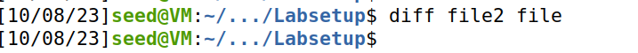
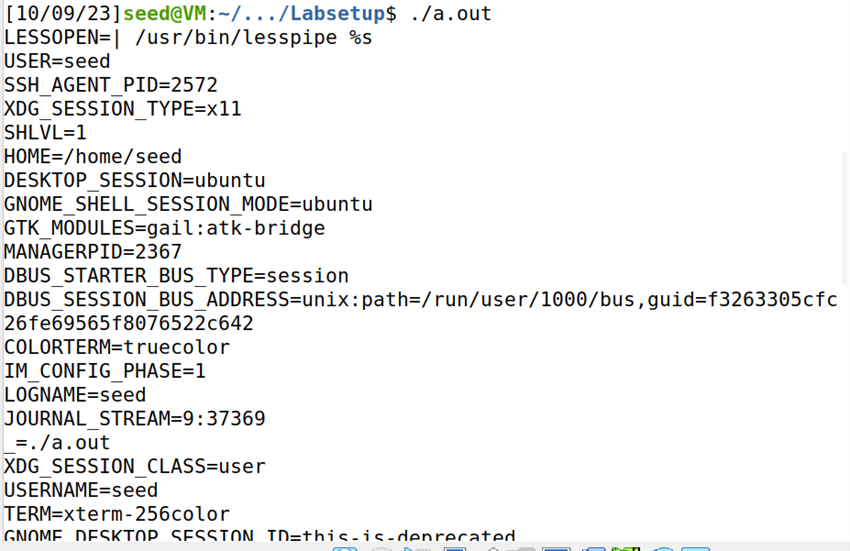
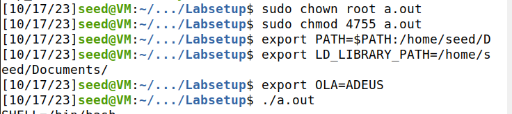
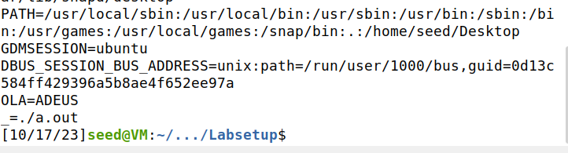
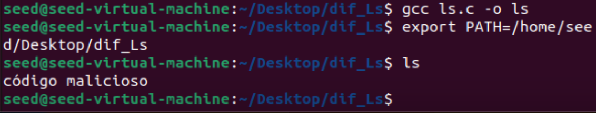

# Environment Variable and Set-UID Program Lab

## Tasks

### Task 1
> Todas as variáveis de ambiente podem ser mostradas no terminal usando printenv.

 ### Task 2
> Não existe nenhum acréscimo entre o ficheiro que guarda as variáveis de ambiente dos processos pai e filho:  
>

### Task 3
> - Inicialmente, ao executar o código com NULL no terceiro argumento a NULL (execve("/usr/bin/env", argv, NULL)), nenhuma variável de ambiente é mostrada no terminal visto que o pointer é nulo.  
> - Trocando o último argumento para a “environ” (execve("/usr/bin/env", argv, environ)), as variáveis já são printed no terminal, já que o array passa as variáveis de ambiente abertas.  

### Task 4
> - A principal diferença é que execve() executa um programa diretamente, enquanto system() executa um comando por meio de um shell. Além disso, system() automaticamente passa as variáveis de ambiente do caller para o novo programa ou comando, o que não é o caso com execve().  
> - Dessa forma ao correr o programa são listadas todas várias variáveis de ambiente que depois podem a ser comprometedoras para a segurança.  
>

### Task 5
> - O mecanismo Set-UID é projetado para conceder privilégios elevados a um programa, mas com restrições rigorosas para evitar abusos e vulnerabilidades de segurança. Para isso, ele herda os privilégios do proprietário original, mas não herda as variáveis de ambiente do executante. Geralmente inicia apenas com um conjunto mínimo de variáveis de ambiente para evitar problemas de segurança. Daí é que se explica que algumas das variáveis de ambiente não constem na lista das variáveis a quando executado como 'root', como por exemplo a LD_LIBRARY_PATH que pode ser comprometedora a nível de segurança pois define um caminho onde o programa vai procurar as bibliotecas dinâmicas partilhadas.  

>

>

### Task 6
> - Nos passos anteriores, foi demonstrado que programas Set-UID geralmente não herdam automaticamente as variáveis de ambiente do processo pai. O programa Set-UID geralmente é executado com um ambiente controlado e seguro.
No entanto, quando um programa Set-UID chama a função system(), ele efetivamente inicia uma shell, que pode ser afetado pelas variáveis de ambiente definidas pelo utilizador.
Para explicar isso foi criado um programa com permissões elevadas (Set-UID), que faz uma chamada 'system("ls")'. Depois outro programa, este malicioso, com o nome "ls" no seguinte diretório: "/home/seed/Desktop/dif_Ls". E ao mudar a variável de ambiente "PATH" para o diretório onde contém o programa malicioso "$ export PATH=/home/seed/Desktop/dif_Ls" vem-se a concluir que o comando "ls" executado foi apenas o do programa malicioso e não o do sistema operativo.

>
