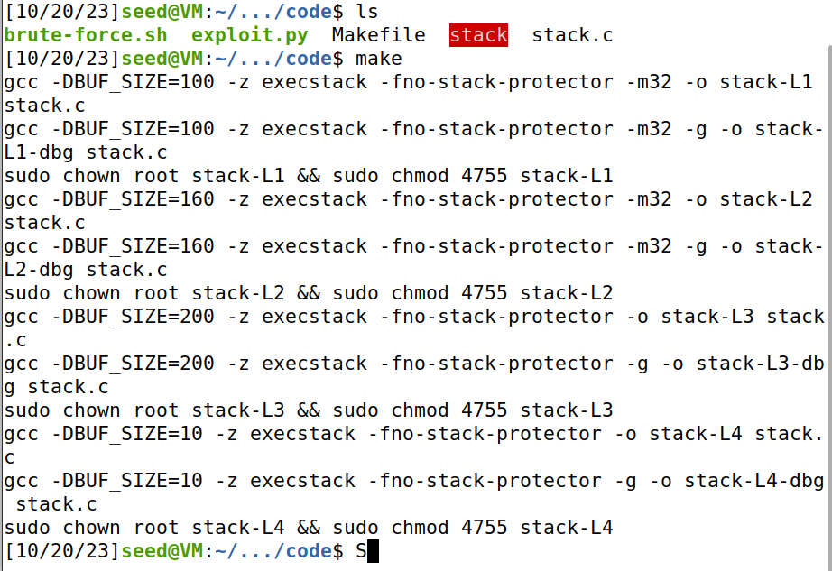
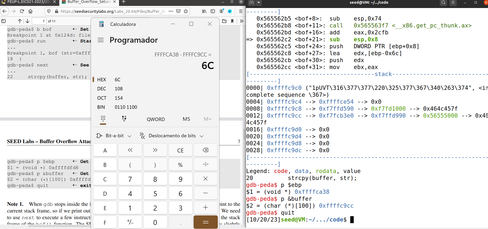
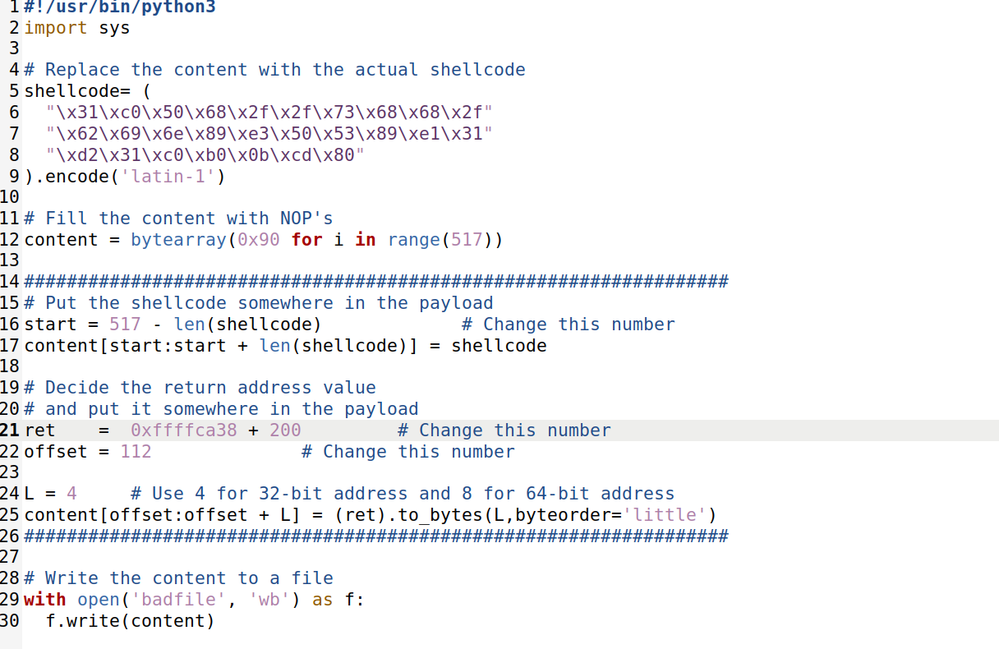
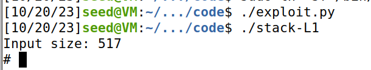
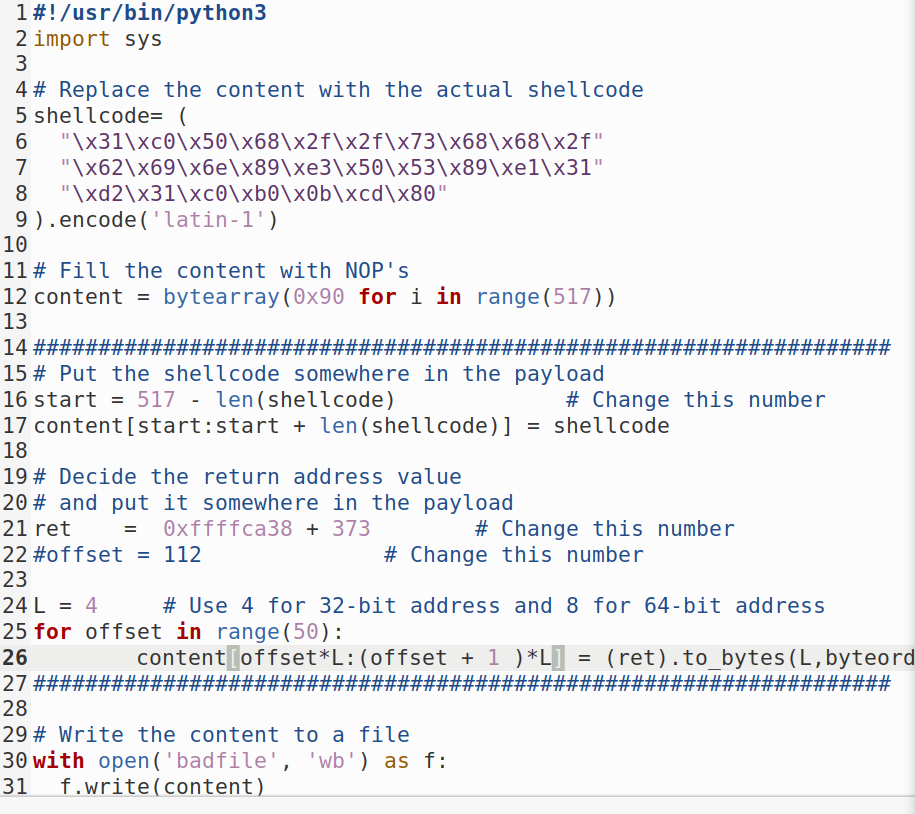
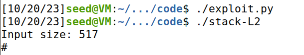

# Buffer Overflow Attack Lab
## Turning Off Countermeasures
> Inicialmente, desativamos certas defesas do sistema operativo, tais como a randomização do espaço de endereços e a restrição que impede a execução da shell por processos com Set-UID. 
> Para desativar a randomização do espaço de endereços, utilizamos o comando: <br>
```
sudo sysctl -w kernel.randomize_va_space=0 
```

> Adicionalmente, para contornar a restrição que proíbe a execução da shell por processos com Set-UID, procedemos com o seguinte comando: <br>
```
sudo ln -sf /bin/zsh /bin/sh 
```


## Tasks

### Task 1: Getting Familiar with Shellcode
>O código dado em C apresenta um exemplo básico de shellcode que lança um shell mas destaca a impossibilidade de usar diretamente o binário gerado a partir deste código como shellcode. Isto pois ao escrever na memória não é possível escrever em código C mas apenas em assembly.
>Os exemplos de shellcode de 32 e 64 bits escritos em assembly são posteriormente usados pelo "call shellcode.c" que incorpora ambas as versões de shellcode (32 bits e 64 bits) e utiliza o Makefile fornecido para compilar os códigos, gerando os binários a32.out (32 bits) e a64.out (64 bits).
>Após a execução, uma nova shell é iniciada através da system call `execve()`.

 ### Task 2: Understanding the Vulnerable Program
> O programa vulnerável utilizado neste laboratório  revela uma vulnerabilidade de buffer overflow na função bof().  A função strcpy() é utilizada para copiar uma entrada de um ficheiro chamado "badfile" para um buffer, sem verificar os limites. O tamanho do buffer é 100 mas o programa lê 517 bytes do arquivo "badfile". Devido à falta de verificação de limites, é possível causar um overflow. <br>
> Para compilar o programa vulnerável fornecido, é essencial desativar as proteções StackGuard e as proteções não executáveis da pilha. <br>
> Utilizamos as opções -fno-stack-protector e "-z execstack" durante a compilação para desativar essas proteções.<br>
> $ gcc -DBUF_SIZE=100 -m32 -o stack -z execstack -fno-stack-protector stack.c <br>
> Após a compilação, é necessário configurar o programa como um programa Set-UID de propriedade do root na seguinte ordem:<br>
``` $ sudo chown root stack```
``` $ sudo chmod 4755 stack ```
>

### Task 3: Launching Attack on 32-bit Program
> Criamos o badfile vazio, executamos o stack.c em modo de debug de forma a descobrir o inicio do buffer e o inicio do ebp, de forma a calcular ao certo o tamanho do buffer (que deu 108), após termos o tamanho do buffer somamos 4 que é o tamanho do ebp e desta forma ficamos com o inicio do endereço de retorno. Este resultado (112) vai servir como offset. 

> Introduzimos o shellcode no nosso badfile, introduzimos os nop's, corrigimos o start para diferença entre 517 (tamanho máximo do array) e o tamanho do shellcode, para que o shellcode seja a ultima coisa a ser colocada. <br>

> Atualizamos o endereço de retorno (ret) de forma a apontar para o shellcode que vamos executar, fizemos o que lá estava antes mas acrescentamos 200 para que apontasse um bocadinho antes do valor exato (pois o valor exato pode não ser 100% exato)

>
>
>>

### Task 4: Launching Attack without Knowing Buffer Size
> Aproveitamos o que tínhamos feito na task3 e apenas mudamos a quantidade de vezes que escrevemos, em vez de ser num só sitio, passa a ser numa range de 100 a 200 bytes, para que caso falhamos o endereço exato, sabemos que está escrito nessa range.
> 
>