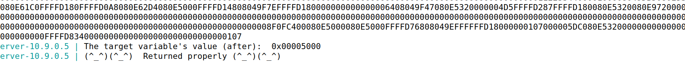

# LOGBOOK7 - Format String Attack Lab

## Setup

Para darmos setup ao ambiente do Lab, teremos de desativar o address space randomization usado na stack e na heap.
Este passo serve para savermos exatamente a ordem e a localização dos endereços dos programas.

```bash
$ sudo sysctl -w kernel.randomize_va_space=0
```

Após dar setup, abrimos dois terminais, um com os servidores usando o Docker e outro (o cliente) para comunicar com os servidores e executar os programas. Isto permite-nos ver as mensagens que são enviadas de um lado para outro. Por exemplo, para mandar uma string para o servidor, podemos fazê-lo desta forma:

```bash
$ echo 'hello' | nc 10.9.0.5 9090
```

O servidor retorna alguns endereços necessários para as tarefas seguintes:
- endereço do buffer de input
- endereço da mensagem secreta
- o endereço inicial e final do target
- frame pointer da função myprintf


## Task 1

Para crashar o servidor basta a string de input:

```bash
$ echo '%s' | nc 10.9.0.5 9090
```

A format string vai buscar o endereço que está logo acima da sua posição na stack e tenta imprimir a string que está nesse endereço. 
Como no lado do servidor não deu print a `Returned properly`, o servidor crashou.

## Task 2

### Task 2.A

Para imprimir os primeiros 4 bytes do input a partir de uma format string, precisamos que o input contenha um valor conhecido para ser mais fácil para identicarmos. Nós usamos "AAAA", que em código ASCII é "41414141". 

A ideia inicial é dar como input "AAAA" concatenado com vários "%x" (usado para dar print em lowercase hexadecimal).


O final "41414141" é o endereço da string "AAAA" dado como input.

Entre "AAAA" e "41414141" existem 504 caracteres e como cada endereço é constituido por 8 caracteres logo, existem 504/8 = 63 endereços na stack entre a format string e o buffer.

Conclui-se que, para imprimir os primeiros 4 bytes do input inicial é necessário criar uma string com exatamente 64 "%x": os primeiros 63 para mostrar os endereços intermédios e o último para mostrar os 32 bits iniciais (4 bytes) do input.

### Task 2.B

Nesta tarefa precisamos de imprimir o conteúdo de uma string presente na Heap no endereço 0x080b4008.

O endereço 0x080b4008 pode ser codificado em string como "\x08\x0b\x40\x08". Ao colocarmos este endereço no início do input seguido de 63 "%08x" (semelhante a usar %x) e um "%s", então a format string irá ler deste endereço e retornar o valor escondido. <br>


O output do lado do servidor foi o seguinte:


A mensagem do endereço é `A secret message`.

## Task 3

### Task 3.A

Nesta tarefa precisamos de alterar o valor da variável `target`. Inicialmente tem valor 0x11223344 e o endereço 0x080e5068.

O comando `%n` nas format strings escreve na zona de memória do argumento passado como parâmetro o número de caracteres escritos até ali.  <br>
O código executado foi semelhante ao usado na Task 2.B, com uma ligeira mundança, ao invés de usarmos a format string `%s`, usamos `%n`.


O output do lado do servidor foi o seguinte:


### Task 3.B

Desta vez o valor de `target` deve ser mudado para o valor 0x5000, ou seja 20480 em decimal. Como sabemos que '%n' irá escrever o número de caracteres escritos até ali, então o input até '%n' terá de ter 20408 caracteres. Como o input é grande, usamos a notação `%.NX`, com N = 20408 - 4 - 63*8 = 19980, para escrever os 19980 que faltam. 


Originou o seguinte output no servidor, alterando o valor de `target` passou a ser 0x00005000:


